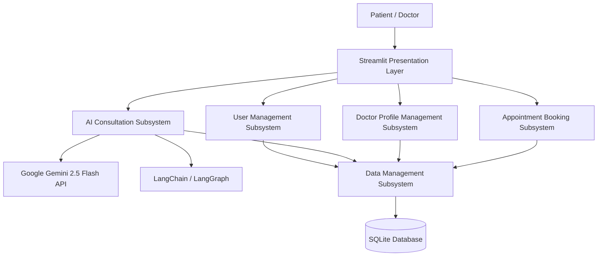

# Dr. Well – AI Medical Assistant

An AI-powered healthcare guidance web application that helps users describe symptoms in natural language, receive AI-generated health guidance, and connect with appropriate doctors — built as a Final Year Project.

---

## Table of Contents

- [Project Overview](#project-overview)
- [Problem Statement](#problem-statement)
- [Objectives](#objectives)
- [Key Features](#key-features)
- [System Architecture](#system-architecture)
- [Technology Stack](#technology-stack)
- [AI Integration](#ai-integration)
- [Database](#database)
- [User Roles](#user-roles)
- [Project Workflow](#project-workflow)
- [Project Structure](#project-structure)
- [Installation and Setup](#installation-and-setup)
- [Running the Application](#running-the-application)
- [Screenshots](#screenshots)
- [Results / Outcomes](#results--outcomes)
- [Limitations](#limitations)
- [Future Improvements](#future-improvements)
- [Medical Disclaimer](#medical-disclaimer)
- [Academic Context](#academic-context)
- [Author](#author)

---

## Project Overview

Dr. Well is an AI-powered medical assistant system that allows users to describe their health concerns in everyday language and receive AI-generated guidance. It uses Google's Gemini AI model to understand symptom descriptions and provide relevant healthcare responses, suggest possible conditions, recommend precautions, and help users identify which type of specialist doctor to consult.

The system was built to help address limited healthcare access, particularly for people in rural or underserved areas who face long wait times, high consultation costs, or difficulty finding the right specialist. Beyond AI consultation, the platform includes doctor profile management, appointment booking, patient record management, medication tracking, and a nutrition advice module.

The application has two main user types — **patients**, who consult the AI and book appointments, and **doctors**, who manage their professional profiles and availability. It is built with Python and Streamlit for the interface, SQLite for data storage, and LangChain for AI integration.

## Problem Statement

Many people struggle to access timely, affordable healthcare. In rural and less developed areas, hospitals are far away, doctors are few, and waiting times can be long. Even in cities, high consultation fees and difficulty finding the right specialist are common problems. Additionally, many people take medicines without proper medical guidance — for example, based on advice from friends or leftover medication — which can lead to serious health risks. Dr. Well was developed to give people accessible, AI-assisted initial guidance before they need to visit a hospital.

## Objectives

**Primary Goals**
- Create an AI-powered medical assistant that can understand patient symptoms and provide helpful guidance
- Use Google Gemini AI to analyze natural language symptom descriptions
- Build a system that suggests treatment guidance, medications, and specialist referrals
- Develop a platform with doctor profiles, appointment booking, and patient history management
- Ensure the system is user-friendly and accessible to everyone

**Specific Objectives**
- Build a web application where users can create accounts and log in
- Implement a chat interface where patients can describe symptoms to the AI
- Configure the Gemini AI model to give relevant healthcare responses
- Create medication extraction from AI responses
- Build doctor profiles with specializations and availability
- Develop an appointment booking system
- Store conversation history for context-aware responses
- Implement a nutrition advisor module
- Create separate interfaces for patients and doctors
- Test the complete system and fix issues

## Key Features

### Patient Features
- Create an account with basic information
- Describe symptoms to the AI and receive health guidance
- Receive medication suggestions extracted from AI responses
- View doctor profiles and specialties
- Book appointments with doctors
- View appointment history
- Track medications
- Receive nutrition advice

### Doctor Features
- Create a professional profile (specialty, qualifications, experience, clinic details)
- Set availability (working days and time slots)
- Manage incoming appointment requests
- View patient appointment history
- View a dashboard summarizing total, pending, and completed appointments

### AI Features
- Natural-language symptom analysis using Google Gemini 2.5 Flash
- AI-based health guidance (the report explicitly describes this as guidance, not medical diagnosis)
- Medication information extraction (name, dosage, timing, frequency) from AI responses
- Intent recognition (distinguishing symptom queries, doctor search requests, or appointment intent)
- Conversation memory for context-aware, multi-turn interactions
- Nutrition recommendations based on health conditions

## System Architecture

The system follows a modular, three-layer architecture: a **Presentation Layer** (Streamlit web pages and custom CSS), a **Business Logic Layer**, and a **Data Layer** (SQLite database operations).

It is further divided into five subsystems:

1. **User Management** – registration, authentication, session handling, profile management, role/permission checks
2. **AI Consultation** – symptom analysis, prompt preparation, Gemini API communication, medication extraction, intent recognition
3. **Doctor Profile Management** – doctor profile creation, listing/filtering, doctor cards, doctor dashboard
4. **Appointment Booking** – booking form handling, availability validation, appointment creation and status tracking
5. **Data Management** – all database read/write operations for users, doctors, patients, appointments, chat history, and medications



## Technology Stack

| Technology | Purpose |
|---|---|
| Python 3.12 | Core programming language |
| Google Gemini 2.5 Flash | AI model powering symptom analysis and response generation |
| LangChain | Framework for prompt management, memory, and LLM integration |
| LangGraph | Structuring AI conversation flow and memory |
| Streamlit | Web application framework / user interface |
| SQLite | Database for users, doctors, appointments, chat history, medications |
| Pydantic | Data validation for inputs and AI responses |
| HTML / CSS | Custom styling of the Streamlit interface |
| Conda | Python package/environment management |
| python-dotenv | Loading environment variables (API keys) securely |
| VS Code | Development environment |

## AI Integration

Dr. Well uses **Google Gemini 2.5 Flash** as its core AI model, selected for fast response times suitable for real-time chat and effective understanding of medical language. **LangChain** provides prompt management, memory handling, and integration with the Gemini API, while **LangGraph** helps structure the conversation flow and manage memory.

The AI consultation process works as follows:
1. The user's symptom description is captured through the chat interface
2. A **Symptom Analyzer** component structures the input and combines it with system prompts
3. An **AI Communicator** component sends the formatted prompt to the Gemini API and manages the API key/response
4. An **Intent Recognizer** identifies whether the user is describing symptoms, searching for a doctor, or requesting an appointment
5. A **Medication Extractor** parses AI responses to identify medication names, dosages, timing, and frequency
6. Responses and extracted data are stored in chat memory for context in future messages

The project applies **prompt engineering** to guide the AI toward safe, relevant, and appropriately scoped responses (e.g., suggesting treatment guidance first, referring to a specialist when needed, and staying within its role as a support tool rather than a diagnostic authority).

**Noted limitation:** the API used during development was on a free/trial plan, and the system requires an internet connection to reach the Gemini API — if unavailable, AI consultation does not work.

## Database

The system uses **SQLite**, chosen for being lightweight, simple to set up, and well suited to a single-file, Python-based application. It stores user accounts, doctor profiles, appointments, chat history, and medications.

**Major data objects (from the report's data model):**

| Data Object | Description | Key Attributes |
|---|---|---|
| User | System users (patients and doctors) | id, username, email, password, user_type, full_name |
| Doctor Info | Doctor professional details | user_id, specialty, qualification, experience, fee, availability |
| Patient Info | Patient health details | user_id, weight, height, allergies, blood_group, conditions |
| Appointment | Appointment bookings | patient_id, doctor_id, date, time, status, symptoms |
| Chat Session | Conversation sessions | user_id, session_id, created_at |
| Chat Memory | Individual messages | user_id, session_id, role, content, symptoms, diagnosis |
| Medication | Prescribed/suggested medications | user_id, name, dosage, frequency, timing, status |

An Entity Relationship Diagram is included in the original FYP report (Figure 3.2) but is not reproduced here.

## User Roles

| Feature | Patient | Doctor |
|---|---|---|
| Account Creation | ✓ | ✓ |
| Profile Management | ✓ | ✓ |
| AI Consultation | ✓ | ✗ |
| View Doctors | ✓ | ✗ |
| Book Appointments | ✓ | ✗ |
| View Appointment History | ✓ | ✓ |
| Manage Availability | ✗ | ✓ |
| View Patient History | ✗ | ✓ |

## Project Workflow

**Patient journey:** Register → Log in → Complete profile → Describe symptoms in chat → Receive AI guidance and medication suggestions → Browse/search doctors by specialty → Book appointment → View appointment history

**Doctor journey:** Register → Complete professional profile → Set availability → Receive/manage appointment requests → View patient appointment history

## Project Structure

Based on Appendix C of the FYP report:

```text
Dr-Well/
│
├── main.py             # Main Streamlit application and page routing
├── agent.py             # AI agent with doctor and nutrition prompts
├── database.py           # SQLite database setup and all data functions
├── ui_components.py        # Reusable Streamlit UI elements
├── config.py            # Application configuration and API key loading
├── requirements.txt        # Python package dependencies
├── .env               # Environment variables (API key, not committed)
├── drwell.db            # SQLite database file (created automatically on first run)
├── logo/               # Dr. Well logo image
├── screenshots/           # App screenshots used in this README
└── README.md
```

## Installation and Setup

Based on Appendix B of the FYP report:

```bash
git clone <repository-url>
cd <project-folder>
```

Install Python 3.11 or 3.12, then install dependencies:

```bash
pip install -r requirements.txt
```

Create a `.env` file in the project root with your Gemini API key:

```text
GOOGLE_API_KEY=your_key_here
```

A free Google API key can be obtained from: https://aistudio.google.com/

## Running the Application

```bash
streamlit run main.py
```

Then open your browser and go to:

```text
http://localhost:8501
```

The report mentions a test account (`test_patient` / `test123`) used during development/testing — replace or remove this before any public deployment.

## Screenshots

### Sign Up


### Patient Dashboard


### AI Medical Consultation


### Find a Doctor


### Book Appointment


### My Appointments


> The report also includes architecture, ER, and flow diagrams (e.g., System Architecture, Entity Relationship Diagram, Use Case Diagram) which are design diagrams rather than app screenshots. These aren't included here — add them separately under a "Design Diagrams" section if you'd like them in the repo too.

## Results / Outcomes

The report describes functional and validation testing rather than quantitative metrics. No accuracy percentages, user counts, or performance benchmarks are reported — none are included here.

Documented testing covered:
- **Unit testing** of registration validation, password hashing, prompt preparation, medication extraction, date/time validation, and database queries — reported as passing, with edge cases handled correctly
- **Integration testing** across registration → database, AI service → chat memory, doctor search → booking, and login → role-based access — reported as working correctly
- **Validation testing** of core user scenarios (symptom consultation, doctor search and booking, profile updates, conversation memory, emergency guidance) — reported as meeting requirements
- **System testing** of complete patient and doctor journeys — reported as functioning correctly
- **Security testing** — SQL injection prevention, password hashing, session management, XSS prevention, input validation — reported as passing
- **Stress testing** — multiple simultaneous users, long conversations, large profile updates — reported as handled well
- Eight sample test cases (TC-001–TC-008) covering registration, login, AI chat (normal and emergency symptoms), doctor search, and appointment booking — all reported as **Pass**

## Limitations

As documented in the FYP report:

- The system provides guidance only and is not a replacement for real doctors
- It does not perform diagnosis — it suggests possible conditions
- It cannot examine patients physically or perform medical tests
- It may not understand very complex or rare symptoms and may make mistakes
- It cannot legally prescribe medication
- It does not integrate with hospitals or pharmacies
- It requires an internet connection to reach the Gemini API
- The API used during development was on a free/trial plan — availability and rate limits are not guaranteed
- Performance testing under heavy load, cross-browser compatibility, and mobile responsiveness were explicitly excluded from testing scope

## Future Improvements

From the report's Future Enhancements chapter:

1. Mobile application (React Native or Flutter)
2. Real-time video consultation between patients and doctors
3. Hospital and pharmacy integration
4. A fine-tuned, medical-domain-specific AI model
5. Multilingual support (currently English only)
6. Integration with wearable medical devices
7. Electronic Medical Records (EMR) storage
8. AI-based image analysis (e.g., rashes, wounds)
9. Digital prescription management
10. Voice interface for symptom input

Recommended next steps noted in the report: cloud deployment (AWS/Azure), additional security measures (e.g., two-factor authentication), stronger privacy/compliance practices, regular AI model updates, and further user testing with real patients and doctors.

## Medical Disclaimer

Dr. Well provides AI-generated informational guidance only. It is not a diagnostic tool and does not replace consultation with a qualified healthcare professional. Any medication-related suggestions produced by the AI should be verified with a doctor or pharmacist before use. In emergencies, users should contact emergency services or visit a hospital directly rather than relying on this system.

## Academic Context

**Academic Project**

Dr. Well was developed as a Final Year Project for the degree of BS Computer Science (Session 2022–2026).

- **University:** University of Sahiwal
- **Department:** Computer Science
- **Supervisor:** Muhammad Waqas, Professor, Department of Computer Science

## Author

**Memoona Abbas** — BSCS-M2-22-21

```text
[GitHub Profile]
[LinkedIn Profile]
```

---

## References

Sources cited in the original FYP report:

- Google, "Gemini API Documentation," Google AI, 2024 — https://ai.google.dev/docs/gemini_api
- Streamlit, "Streamlit Documentation," 2024 — https://docs.streamlit.io
- LangChain, "LangChain Documentation," 2024 — https://python.langchain.com/docs
- Python Software Foundation, "Python Documentation," 2024 — https://docs.python.org
- SQLite, "SQLite Documentation," 2024 — https://www.sqlite.org/docs.html
- S. Russell and P. Norvig, *Artificial Intelligence: A Modern Approach*, 4th ed., Pearson, 2020
- World Health Organization, "Digital Health," WHO, 2023 — https://www.who.int/health-topics/digital-health
